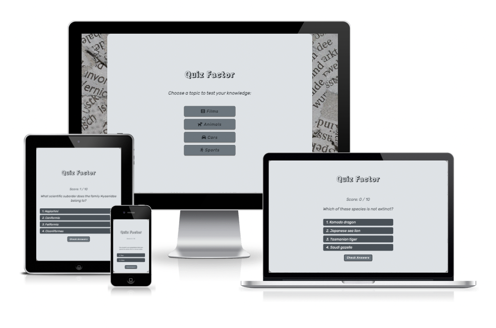
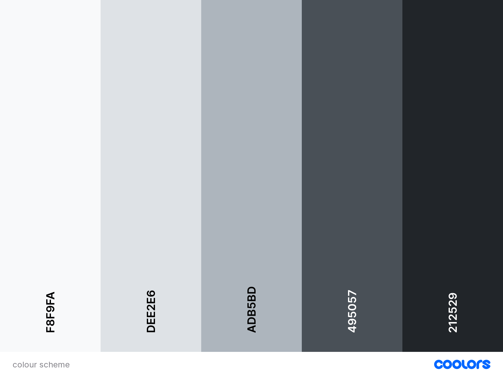

# Quiz Factor

Quiz Factor is an online interactive learning game to test your knowledge in 4 different categories.

Visit the deployed site: [Quiz Factor](https://paulasdev.github.io/factor-quiz/)

# Repository

## **Table of Contents**

1. [UX Development](#ux-development)
    * [Project Goal](#project-goal)

    * [User Stories](#user-stories)
        * [First Time Visitor Goals](#first-time-visitor-goals)
        * [Returning Visitor Goals](#returning-visitors-goals)
        * [Site Owners Goals](#site-owners-goals)

    * [Design](#design)
        * [Colour Scheme](#colour-scheme)
        * [Typography](#typography)
        * [Imagery](#imagery)
        * [Site Structure](#site-structure)
        * [Wireframes](#wireframes)
      
2. [Features](#features)  
    * [Existing Features](#existing-features)
        * [Navigation Bar](#navigation-bar)
        * [Header](#header)
        * [Features Section](#features-section)
        * [About Section](#about-section)
        * [Product Section](#collection-section)
        * [Newsletter Section](#contact-section)
        * [Footer](#footer)
        
3. [Technologies Used](#Technologies-Used)  
    * [Language Used](#language-used)
    * [Tools and Libraries](#tools-and-libraries)

4. [Testing](#testing)
    * [JavaScript](#javascript)
    * [Unfixed Bugs](#unfixed-bugs)

5. [Deployment](#deployment)  
  
6. [Credits](#credits)  
    * [Content](#content)
    * [Media](#media)  

- - -

# **Table of Contents**

## UX Development
### Project Goal
Demonstrate my competence using HTML, CSS and JavaScript languages in building a responsive website.
The game aims to test the user's knowledge in 4 categories: Car, Animals, Movies and Sports.

---
## User Stories
#### First Time Visitor Goals

* Easily navigation to the interactive quiz.
* Clear instructions and easy-to-follow steps.
* A simple designer and clear structure to easily navigate the site/game
* Able to see my score during the game.
* Able to from mobile or desktop. 
* Able to Restarts the score and the game.

#### Returning Visitor Goals

* Able to choose a category to keep improving the knowledge.

### Site Owners Goals

* Create an easily navigated site using a single page format.
* Responsive design, based on mobile-first.
* Use single-page layout.
* Give a positive user experience through colours and layout.

---

## Design
### Colour Scheme
The colour scheme was based on the background image - A newspaper. I wanted to keep the colour scheme that best matched the background image and kept it simple for users to see.

### Typography
Google Fonts was used to import the chosen fonts for use in the site.
For the page title I have used the google font Rampart One.
For the body of the page I have used the google font Rubik.

### Imagery
The newspaper as the image used as the background image was based on "getting" knowledge on different subjects.

### Site Structure
 
### Wireframes

## Technologies Used

### Languages Used

HTML, CSS, Javascript

### Tools and Libraries Used

* [Google Developer Tools](https://developers.google.com/web/tools) - To troubleshoot and test features, solve issues with responsiveness and styling.

* [Balsamiq](https://balsamiq.com/) - Used to create wireframes.

* [Git](https://git-scm.com/) - For version control.

* [Github](https://github.com/) - To save and store the files for the website.

* [GitPod](https://gitpod.io/) - IDE used to create the site.

* [Favicon.io](https://favicon.io/) To create favicon.

* [Google Fonts](https://fonts.google.com/) - To import the fonts used on the website.

* [jQuery](https://jquery.com/) - A JavaScript library.

* [Am I Responsive?](http://ami.responsivedesign.is/) To show the website image on a range of devices.

* [Open Trivia DataBase](https://opentdb.com/) - API used for the trivia questions.

* [JSON Formatter](https://chrome.google.com/webstore/detail/json-formatter/bcjindcccaagfpapjjmafapmmgkkhgoa) - a google chrome extension to enable you to view JSON as raw data or parsed.

## Deployment

### How to fork:
To fork the repository:

1. Log in (or sign up) to Github.
2. Go to the repository for this project.
3. Click the Fork button in the top right corner.

### How to Clone
To clone the repository:

1. Log in (or sign up) to GitHub.
2. Go to the repository for this project.
3. Click on the code button, select whether you would like to clone with HTTPS, SSH or GitHub CLI and copy the link shown.
4. Open the terminal in your code editor and change the current working directory to the location you want to use for the cloned directory.
5. Type 'git clone' into the terminal and then paste the link you copied in step 3. Press enter.